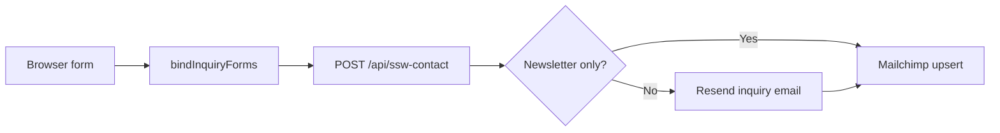

# Standing Sun Wines

Next.js site for [Standing Sun Wines](https://www.standingsunwines.com). Static SSW page HTML is prepared into `lib/ssw/prepared/`; React wires nav, form submission, and metadata on top. Sanity Studio is embedded at `/studio`.

## Setup

Copy `.env.example` to `.env.local` and fill in values. Run `npm install` and `npm run dev`.

**Mailchimp:** `MAILCHIMP_SERVER` is your API datacenter (e.g. `us4`). It must match the suffix on your API key (keys look like `xxxxxxxx-us4`).

---

## Email automation

All four site forms POST to **`/api/ssw-contact`** (`app/api/ssw-contact/route.ts`).



### What happens on submit

1. **Client** (`lib/forms/bind-inquiry-forms.ts`) intercepts `.ssw-inquiry-form` submits, collects fields, and optionally adds a **city/state location** (browser geolocation + Mapbox reverse geocode when the user engages with the form).
2. **API** receives `{ page, fields }`.
3. **Resend** — skipped for the homepage newsletter only; all other forms send a styled HTML/text email to `HOST_INQUIRY_TO_EMAIL` with `replyTo` set to the submitter's email. Blank fields are omitted from the email body (`lib/email/inquiry-template.ts`).
4. **Mailchimp** — every successful submission upserts the contact (`lib/mailchimp/upsert-inquiry.ts`):
   - Merge fields: `FNAME`, `LNAME`, optional `PHONE`, optional inquiry summary (`MAILCHIMP_MERGE_INQUIRY`), optional location (`MAILCHIMP_MERGE_LOCATION`, e.g. `LOCATION`)
   - Tags: `website-inquiry`, `page-{page}`, `interest-{type}` (from `interest`, `inquiry_type`, `event_type`, `winemaker_type`, or `annual_production`)

### Newsletter-only detection

Homepage `#contact` with hidden `interest=Newsletter` and `page=home` → **Mailchimp only, no Resend** (`lib/forms/newsletter-signup.ts`).

### Environment variables (`.env.local` / production host)

| Variable | Purpose |
|----------|---------|
| `NEXT_PUBLIC_SITE_URL` | Canonical site URL (OG tags, metadata) |
| `NEXT_PUBLIC_MAPBOX_TOKEN` | Reverse geocode lat/lng → city/state for Mailchimp location merge |
| `RESEND_API_KEY` | Resend API key (forms 2–4) |
| `RESEND_FROM` | Sender, e.g. `Standing Sun Wines <hello@standingsunwines.com>` — **must use a verified domain in production** |
| `HOST_INQUIRY_TO_EMAIL` | Inbox that receives inquiry emails |
| `MAILCHIMP_API_KEY` | Mailchimp API key |
| `MAILCHIMP_AUDIENCE_ID` | Audience/list ID |
| `MAILCHIMP_SERVER` | Datacenter prefix (e.g. `us3`) |
| `MAILCHIMP_MERGE_LOCATION` | Optional merge tag name for city/state (default setup uses `LOCATION`) |
| `MAILCHIMP_MERGE_INQUIRY` | Optional merge tag for a short inquiry summary |

**Production reminders**

- Resend sandbox (`onboarding@resend.dev`) only delivers to your Resend account email until the domain is verified.
- Restart `next dev` (or redeploy) after changing env vars.
- After deploy, refresh link previews: [Facebook Sharing Debugger](https://developers.facebook.com/tools/debug/), [LinkedIn Post Inspector](https://www.linkedin.com/post-inspector/).
- OG image: `public/og-image.jpg` (via `lib/site-metadata.ts`).

---

## The four forms

All forms use class `ssw-inquiry-form`. Legacy Web3Forms hidden fields (`subject`, `from_name`, etc.) may remain in HTML but are ignored by the API.

| # | Where | `page` value | Resend email | Mailchimp |
|---|--------|--------------|--------------|-----------|
| 1 | Homepage `/#contact` — Join Our List | `home` | No | Yes |
| 2 | `/contact` — `#contact-form` | `contact` | Yes | Yes |
| 3 | `/winery` — `#inquiry` (Custom Crush) | `winery` | Yes | Yes |
| 4 | `/private-events` — `#inquiry` | `private-events` | Yes | Yes |

### 1. Homepage newsletter (`/#contact`)

- **Source HTML:** `generated/ssw-html/standingsunwines_v19.html`
- **Fields:** `first_name`, `last_name`, `email`, `phone` (optional), hidden `interest=Newsletter`
- **Success copy:** themed message below the form (not a separate Resend notification)

### 2. Contact form (`/contact`)

- **Source HTML:** `generated/ssw-html/contact.html`
- **Fields:** `first_name`, `last_name`, `email`, `phone`, `inquiry_type`, `message` (required)
- **Conditional blocks** (shown/hidden by `bindInquiryTypeSelect` in `bind-inquiry-forms.ts`):
  - **Custom Crush:** `winemaker_type`, `annual_production`, `target_start_date`
  - **Event types** (wedding, corporate retreat, private party, rehearsal dinner, other): `estimated_date`, `guest_count`
  - **General inquiry:** `general_topic`
- **`inquiry_type` options** (`lib/forms/inquiry-options.ts`): Custom Crush, Wedding, Corporate Retreat, Private Party, Rehearsal Dinner, Other Private Event, General Inquiry

### 3. Winery / Custom Crush (`/winery` `#inquiry`)

- **Source HTML:** `generated/ssw-html/winery.html`
- **Fields:** `first_name`, `last_name`, `email`, `phone`, `winemaker_type`, `annual_production`, `message`
- **Email subject line (legacy hidden):** Custom Crush / Winemaker in Residence

### 4. Private events (`/private-events` `#inquiry`)

- **Source HTML:** `generated/ssw-html/private-events.html`
- **Fields:** `first_name`, `last_name`, `email`, `phone`, `event_type`, `estimated_date`, `guest_count`, `message`
- **`event_type` options:** Wedding, Corporate Retreat / Offsite, Private Party, Rehearsal Dinner, Other

---

## Events & ticketing

**Standing Sun Live** (`/shawnmullins`) lists concerts and ticket sales. The site does **not** use Sanity for public event listings.

| Phase | Source |
|-------|--------|
| **Now** | [Eventbrite](https://www.eventbrite.com/o/standing-sun-wines-121252721971) — linked from `/shawnmullins` and the homepage events teaser |
| **Next** | [Ticket Tailor](https://www.tickettailor.com/) box office embed on `/shawnmullins` |

Set `NEXT_PUBLIC_TICKET_TAILOR_BOX_OFFICE_URL` to override the default Standing Sun Live box office URL. The embed lives in `components/events/TicketTailorEmbed.tsx` and matches Ticket Tailor's official inline widget attributes.

Legacy `/events` and `/events/[slug]` URLs redirect to `/shawnmullins`. Sanity may still contain an `event` schema for studio experiments, but it is not wired to the public site.

---

Pages are generated from `newSiteFiles/` via scripts. After changing those HTML files, run:

```bash
npm run extract:ssw && npm run prepare:ssw && npm run merge:ssw-css
```

That writes `app/ssw/ssw-base.css` (home), plus `ssw-winery.css`, `ssw-private-events.css`, and `ssw-contact.css` (each route imports its own so selectors do not fight). Prepared bundles land in `lib/ssw/prepared/` and `generated/ssw-html/`.

**Homepage hero image:** The embedded hero is often low resolution (e.g. 900px wide), so `background-size: cover` on a full viewport looks blurry. `merge:ssw-css` runs `extract:hero-hires` afterward; you can also run `npm run extract:hero-hires` alone. It reads the base64 from `newSiteFiles/standingsunwines_v19.html`, uses **sharp** for JPEG quality 98 and 4:4:4 chroma subsampling, and if the source is under 1800px wide it **auto-upscales** to 2560px (Lanczos3). Use `HERO_NO_UPSCALE=1` to skip upscaling, or `HERO_MIN_WIDTH=3840` to force a target width.

**Key files**

| Area | Path |
|------|------|
| Form binding | `lib/forms/bind-inquiry-forms.ts`, `lib/forms/submit-inquiry.ts` |
| API route | `app/api/ssw-contact/route.ts` |
| Email template | `lib/email/inquiry-template.ts` |
| Mailchimp | `lib/mailchimp/upsert-inquiry.ts` |
| Page shell | `components/ssw/SswPageBody.tsx` |
| Nav / metadata | `components/ssw/SswNav.tsx`, `lib/site-metadata.ts` |

**Dev**

```bash
npm install
npm run dev
```
